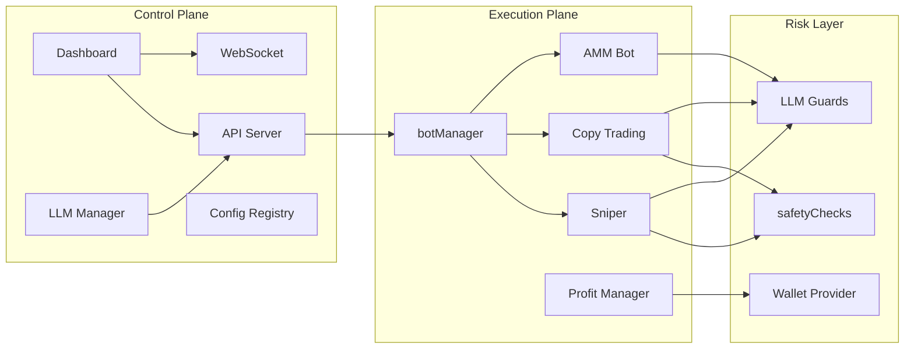
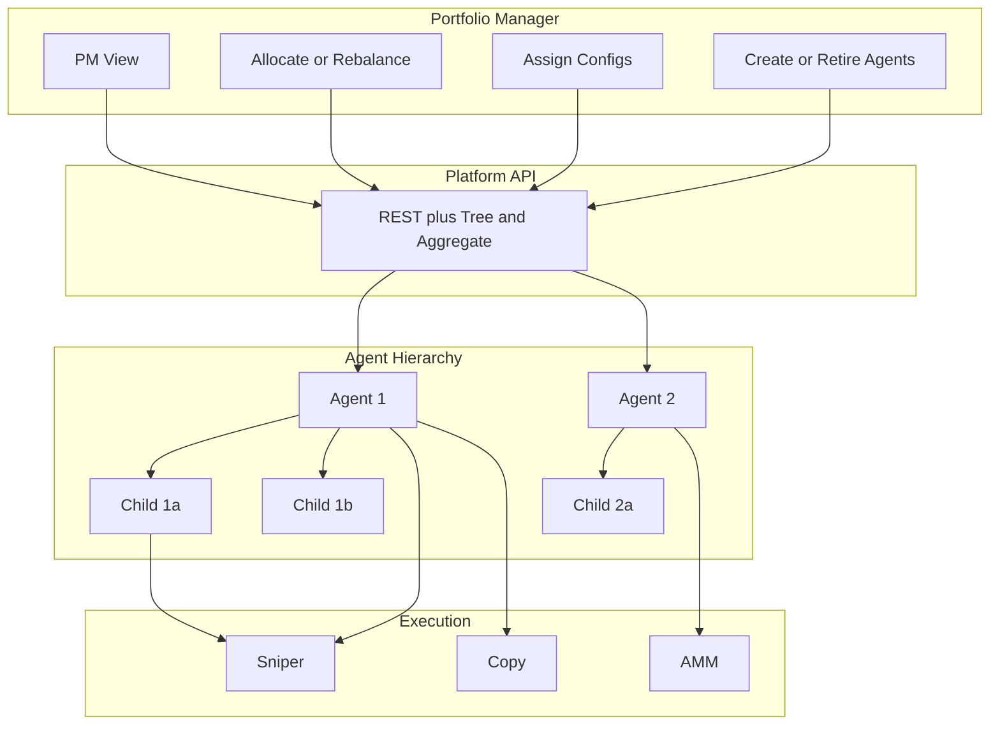

# Platform Architecture (Mermaid)

## Control vs execution plane

## Portfolio manager and agent hierarchy

## Data flow (high level)

- **Config / instances:** Dashboard and API CRUD configs; start/stop sends commands to botManager; botManager runs strategy loops per instance and userId.
- **Agents:** LLM agents are stored in `data/llm-agents.json`; wallet seeds in `data/llm-wallet-seeds.json`. Start-config validates allowed strategies and optional assigned configs, then starts a bot instance for that agent’s userId.
- **Trades:** Strategy code calls safety checks and LLM guards, then executes via XRPL client; profit manager and position tracking update state; Socket.IO broadcasts events to the dashboard.

## Agent lifecycle

1. **Create:** API or dashboard creates agent (name, wallet address, allocation, policy).
2. **Bind wallet:** Operator binds a wallet seed for the agent’s userId; platform verifies address match.
3. **Assign config:** Set default or allowed configs; config’s enabled strategies must be in agent’s allowedStrategies.
4. **Start:** Start agent (one-click with default config) or start a specific config; botManager runs strategies for that userId.
5. **Spawn (optional):** Parent agent spawns child with allocation and policy; child gets its own userId and wallet binding.
6. **Stop / retire:** Stop instances; optionally pause or retire agent; per-agent running configs are persisted for restore on boot.
